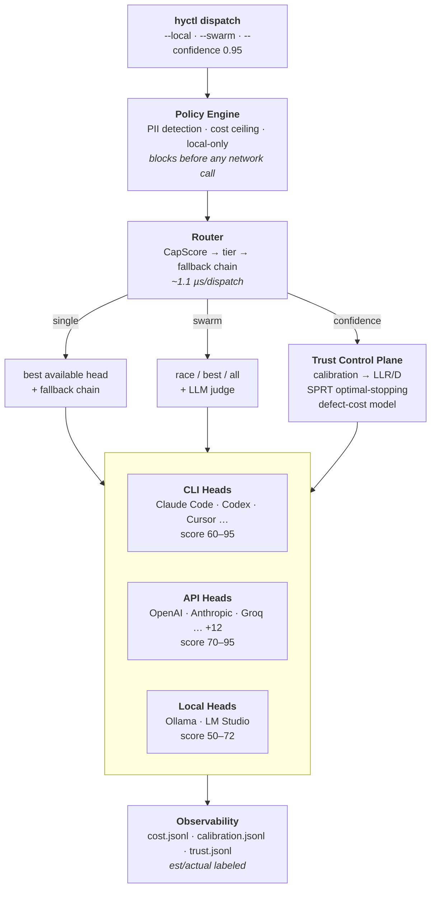

<div align="center">

<pre>
    ██╗  ██╗██╗   ██╗██████╗ ██████╗  █████╗ 
    ██║  ██║╚██╗ ██╔╝██╔══██╗██╔══██╗██╔══██╗
    ███████║ ╚████╔╝ ██║  ██║██████╔╝███████║
    ██╔══██║  ╚██╔╝  ██║  ██║██╔══██╗██╔══██║
    ██║  ██║   ██║   ██████╔╝██║  ██║██║  ██║
    ╚═╝  ╚═╝   ╚═╝   ╚═════╝ ╚═╝  ╚═╝╚═╝  ╚═╝
</pre>

### The Trust Control Plane for AI Development

*Route to a **confidence of correctness**, not just the cheapest model.*
*One command. Every model. Provable trust.*

[](LICENSE)
[](go.mod)
[](https://hydra.uvansa.com#platform-support)
[](https://github.com/ankit373/hydra/stargazers)
[](https://github.com/ankit373/hydra/issues)
[](CONTRIBUTING.md)

<br/>

[**Website**](https://hydra.uvansa.com) · [**Docs**](https://hydra.uvansa.com/docs) · [**Roadmap**](https://github.com/users/ankit373/projects/2) · [**Issues**](https://github.com/ankit373/hydra/issues)

</div>

---

## What is Hydra?

You have Claude Code for complex problems, Codex for code generation, Ollama running local models, API keys for half a dozen providers. Every prompt goes to the most expensive model because routing is manual. Sensitive data flows through third-party APIs because there is no enforcement layer. You have no idea what you're spending across all of them.

**Hydra is the control plane that sits in front of all of it.**

It discovers every AI model on your machine, assigns each a capability score, and routes tasks not just to the cheapest one but to a *target confidence of correctness* — enforcing PII policy so sensitive data never leaves your machine, and logging every dispatch with token counts and cost, without any manual configuration.

**Confidence routing** samples models adaptively (SPRT) and stops the moment you're sure enough, using per-model calibration built from real outcomes (see **Confidence Routing** under [Features](#features)) — and because cheap or local models handle the tasks that don't need a frontier model, this typically cuts LLM spend 70-85% along the way.

```bash
brew install ankit373/hydra/hyctl && hyctl init
```

> **Pure Go, single binary.** Hydra is one `hyctl` CLI — the legacy shell layer is gone. Everything below runs through `hyctl <command>`.

---

## Works With

Hydra discovers and routes to all of these automatically — no plugins, no manual config:

**Coding Agents & CLIs**

| | | | | |
|:-:|:-:|:-:|:-:|:-:|
|  |  |  |  |  |
|  |  |  |  |  |

**API Providers**

| | | | | | |
|:-:|:-:|:-:|:-:|:-:|:-:|
|  |  |  |  |  |  |
|  |  |  |  |  |  |

**Local Runtimes**

| | |
|:-:|:-:|
|  |  |

---

## Architecture



Every executor is **native Go** — `agy`, Ollama, per-provider HTTP (OpenAI-compatible + Anthropic/Gemini/Cohere/Azure/Bedrock/Replicate), and generic CLI. No shell scripts in the hot path.

---

## By the Numbers

| Metric | Value | How it's measured |
|---|---|---|
| Routing overhead | **~1,130 ns / dispatch** | `go test -bench=BenchmarkRoutingPath` (Apple M1): policy eval + head selection + budget check |
| Cost vs all-frontier | **75–85% lower** | typical coding session where most tasks are SIMPLE/STANDARD; see `hyctl stats` for your own numbers |
| Machine discovery | **< 2 s** for 13+ CLIs, 14 API providers, 2 local runtimes | concurrent PATH + env + port scan (`hyctl probe`) |
| Calibration convergence | a 90%-reliable source → **D ≈ 1.76 nats** diagnostic power | `internal/trust` table tests; a coin-flip source → **D ≈ 0** (contributes nothing) |
| SPRT — easy tasks | **2.6 samples, −49% vs fixed-5**, 98.8% accuracy | 20k seeded synthetic trials, `TestSPRT_Law3` |
| SPRT — blended workload | **3.8 samples, −24% vs fixed-5**, 98.2% accuracy | same suite; 71% easy / 29% hard task mix |
| SPRT — hard tasks | **6.8 samples** (adaptively *more* than 5), 96.7% accuracy | fixed-N ensembles can't do this — SPRT spends where accuracy demands it |
| Optimal parallelism | **6 agents** for independent work → **2** for same-subgraph edits | `n* = √((1−s)/k)`, Law 4; `k` from graph coupling (`internal/optimal`) |
| Context signal density | useful tokens = `length × ρ`; a dense 100k window beats a noisy 1M | Law 5; ρ via gzip-ratio proxy (`internal/entropy`) — compact on falling ρ |
| Output capture | bounded at **33 MB** per subprocess | `internal/util.Accumulator` — no unbounded buffers |

> **Methodology & honesty.** Routing overhead, discovery, calibration, and SPRT figures are **measured** — reproduce the SPRT numbers yourself with `hyctl trust benchmark` (deterministic for a fixed seed; race-clean in CI). The SPRT numbers come from *synthetic* trials with known ground truth, not production traffic — they validate the algorithm (Wald sequential test), and land above the continuous theoretical `E[N]` (easy 1.33 / blended 2.48) because real evidence arrives in discrete steps. Cost-savings ranges are workload-dependent estimates; `hyctl stats` reports your actual spend. As production `trust.jsonl` accumulates, `hyctl trust stats` graduates these from *modeled* to *observed*.

---

## The Math

Hydra's routing decisions are not heuristics with a confident tone — each one is a named result you can check. Every equation below is either a **theorem we apply** or a **quantity we measure**, tagged so you always know which:

> ⊢ **proven** — an established theorem · ▣ **measured** — computed in-repo, reproducible · ◈ **synthetic** — seeded benchmark, known ground truth · ○ **modeled** — an estimate or proxy

### 1 · Confidence routing — Wald's Sequential Probability Ratio Test

Instead of always polling a fixed number of models, Hydra accumulates the log-likelihood ratio across votes $x_1,\dots,x_n$ and stops the instant the evidence is conclusive:

$$\Lambda_n = \sum_{i=1}^{n} \ln \frac{P(x_i \mid \text{correct})}{P(x_i \mid \text{incorrect})}, \qquad \text{accept if } \Lambda_n \ge A,\ \ \text{reject if } \Lambda_n \le B$$

$$A = \ln\frac{1-\beta}{\alpha}, \qquad B = \ln\frac{\beta}{1-\alpha}$$

for target error rates $\alpha,\beta$. Wald proved this minimizes the **expected number of samples** $E[N]$ among *all* tests with the same error bounds.

*Analogy — a doctor ordering one test at a time and stopping the moment the diagnosis is certain, instead of always running the full panel.*
⊢ Wald (1945), optimality proven · ◈ −24% (blended) / −49% (easy) samples vs fixed-5 at ≥98% accuracy — reproduce with `hyctl trust benchmark` · source: [`internal/trust`](internal/trust)

### 2 · Calibration — diagnostic power `D`

Every source (model or verifier) earns a sensitivity $se=P(\text{says correct}\mid\text{correct})$ and specificity $sp=P(\text{says incorrect}\mid\text{incorrect})$ from real outcomes (a Beta-Bernoulli posterior). A single vote is worth an LLR of $\ln\frac{se}{1-sp}$ (a "correct" vote) or $\ln\frac{1-se}{sp}$ (an "incorrect" vote). Its **diagnostic power** is the expected evidence per vote — the KL divergence between the vote distributions under the two hypotheses, in nats:

$$D = se\,\ln\frac{se}{1-sp} + (1-se)\,\ln\frac{1-se}{sp}$$

A perfectly reliable source has large $D$; a coin-flip source ($se=sp=0.5$) has $D=0$ and contributes nothing no matter how often it votes. A 90%-reliable source gives $D\approx 1.76$ nats.

*Analogy — a witness's credibility, measured in nats. A coin-flip witness tells you nothing however many times they testify.*
⊢ information theory (KL divergence) · ▣ measured — the 90% → 1.76-nat figure is a table test in [`internal/trust`](internal/trust)

### 3 · When to stop — the defect-cost bar

Confidence isn't free and defects aren't equal, so the required bar is a Bayes-risk decision. The expected loss of shipping an answer believed correct with confidence $c$ is $(1-c)\,C_{\text{defect}}$; ship only when that clears a loss tolerance $\tau$:

$$c^\star = 1 - \frac{\tau}{C_{\text{defect}}}$$

A costlier defect ⟹ a higher confidence bar ⟹ SPRT samples more before it stops. Blast radius (§4) feeds $C_{\text{defect}}$.

*Analogy — you demand far more certainty before heart surgery than before a haircut.*
⊢ Bayes decision theory · ○ $C_{\text{defect}}$ is a modeled estimate (`hyctl trust defect`) · source: [`internal/trust`](internal/trust)

### 4 · Blast radius — Molloy–Reed percolation

Treat the code as a graph with degree mean $\langle k\rangle$ and second moment $\langle k^2\rangle$. A **giant connected component** — a cascade-capable core where one change can ripple everywhere — exists precisely when the Molloy–Reed criterion holds:

$$\kappa = \frac{\langle k^2 \rangle}{\langle k \rangle} \ge 2$$

Files inside a high-$\kappa$ core get their confidence bar raised: an edit to a hub everything imports must be far surer than an edit to a leaf helper.

*Analogy — the epidemic threshold $R_0$: below it a change stays local; above it, one edit can infect the whole graph.*
⊢ Molloy–Reed (1995), proven · ▣ computed from `graph.json` in [`internal/graph`](internal/graph) — see `hyctl graph blast`

### 5 · Optimal parallelism — Amdahl + coordination

Fanning work across $n$ agents speeds the parallel part but adds coordination cost that grows with $n$. With serial fraction $s$ and per-agent coupling $k$, wall-clock time is

$$T(n) = s + \frac{1-s}{n} + k\,n \quad\xrightarrow{\ \frac{dT}{dn}=0\ }\quad n^\star = \sqrt{\frac{1-s}{k}}$$

Independent files (small $k$) → fan out to ~6 agents; tightly-coupled edits to the same subgraph (large $k$) → ~2. More is slower.

*Analogy — adding cooks to a kitchen: past $n^\star$ they spend more time coordinating than cooking.*
⊢ Amdahl (1967) + coordination term · ▣ $k$ derived from graph coupling in [`internal/optimal`](internal/optimal) — see `hyctl graph parallel`

### 6 · Context governor — signal density, not length

A context window's value is its information density, not its token count. Hydra proxies the entropy rate with a compression ratio $\rho\in(0,1]$ and counts only the *useful* tokens:

$$\rho = \frac{\lvert \text{gzip}(C) \rvert}{\lvert C \rvert}, \qquad \text{useful tokens} = L \cdot \rho$$

Highly compressible context (repetitive, stale) has low $\rho$ and few useful tokens — so Hydra compacts on **falling $\rho$**, not on raw length. A dense 100k window beats a noisy 1M one.

*Analogy — signal-to-noise: a short, sharp briefing beats a rambling transcript ten times its length.*
⊢ Shannon source-coding (entropy rate) · ○ gzip is a proxy, not a proof — a heuristic · source: [`internal/entropy`](internal/entropy) — see `hyctl context entropy`

> **See it move.** The interactive derivations — the SPRT log-odds walk hitting its boundaries, the percolation phase transition at $\kappa=2$, the Amdahl curve with its $n^\star$ marker, and the KL overlap that *is* `D` — live on the [**First Principles** page](https://hydra.uvansa.com/first-principles.html).

---

## Features

### 🔍 Zero-Config Discovery

Hydra scans your machine in under two seconds. No config files to edit, no plugins to install.

```
$ hyctl probe

  Heads discovered (6)                           2.1s

  › claude              Claude Code         score:95  cli    ✓ ready
    codex               OpenAI Codex        score:88  cli    ✓ ready
    openai              OpenAI (API)        score:88  env    ✓ key found
    ollama/qwen3:8b     Qwen3 8B            score:66  port   ✓ running
    ollama/phi4-mini    Phi-4 Mini          score:64  port   ✓ running
    anthropic           Anthropic (API)     score:95  env    ✓ key found
```

Scanning happens across three channels simultaneously:

| Channel | What it finds |
|---------|---------------|
| **PATH scan** | 13+ CLI tools — Claude Code, Codex, Cursor, Kiro, Windsurf, Gemini, Copilot, Cody, Amp, Continue, Ollama binary |
| **Port scan** | Ollama (11434), LM Studio (1234) — queries each server and lists every installed model individually |
| **Env vars** | 14 API providers — Anthropic, OpenAI, Google, xAI, Groq, Together, Fireworks, Mistral, DeepSeek, Bedrock, Azure, Perplexity, Cohere, Replicate |

### 🧠 Hardware-Aware Local Model Selection

When you have Ollama, Hydra picks the best model for your actual available memory — not your total RAM. It reads 7 days of memory usage history and uses the 75th-percentile free memory reading so the recommendation reflects how your machine actually runs under typical load, not a lucky snapshot.

```
  Detected: Apple Silicon · 16GB total · memory fully occupied (1.2GB free)
  ⚠  Memory tight — close other apps to run local models

  Recommended alternatives (free tiers available):

  ✓ Claude Code   Free tier via claude.ai — npm install -g @anthropic-ai/claude-code
  ✓ OpenAI Codex  Free tier — npm install -g @openai/codex
  ✓ Cursor        Free tier IDE — cursor.com
```

```
  Detected: Apple Silicon · 32GB total · 18.4GB free for models
  Based on 14 samples over 6 days · typical free: 17.8GB avg, 16.2GB p75

  ✓ Qwen2.5-Coder 32B   32B   uses ~20GB · 0.4GB left (very tight)
  ✓ Qwen3 14B           14B   uses ~10GB · 6.2GB left free
  ✓ Qwen2.5-Coder 14B   14B   uses ~10GB · 6.2GB left free
  ✓ Qwen3 8B             8B   uses ~6GB  · 10.2GB left free  ← recommended
  ✓ Qwen2.5-Coder 7B     7B   uses ~5GB  · 11.2GB left free
```

### 🔒 PII-Aware Routing (Enforced, Not Conventional)

Enable local-only policy in `hyctl init` and any prompt containing sensitive data is blocked from leaving your machine — at the dispatch layer, before any network call is made.

Detected patterns: Social Security Numbers, credit card numbers, email addresses, API keys and tokens, IP addresses, private key material.

```bash
$ hyctl dispatch "process payment for card 4111-1111-1111-1111"

  Policy violation: prompt contains PII (credit card pattern)
  Action: routing to local-only head

  Dispatching → ollama/qwen3:8b  [local, no API call made]
```

### 💰 Full Cost Visibility

Every dispatch is logged to `~/.hydra/cost.jsonl` with model, tier, token counts, estimated cost, and fallback chain. Costs are **honestly labeled**: `tokens_source` marks whether a provider reported real usage or Hydra estimated it, and `cost_source` is always `estimated` (pricing × tokens, never a billed figure). Run `hyctl cost` or `hyctl stats` to see where your budget is going, or `hyctl stats --latency` for p50/p90/p99 per model — computed from mergeable sketches accurate to within 1%, so percentiles survive even after the raw rows are gone. Each row also carries `act_prob` (the probability the router picked that head) and `keep_prob` (the probability the row was kept), so a sampled log can still be read without bias — averaging a non-uniformly sampled log understates rates badly enough to reverse which head looks better.

```
$ hyctl cost

  Cost — last 30 days

  Model                 Dispatches   Tokens       Est. Cost
  claude                12           48,200        $0.72
  openai                4            12,100        $0.18
  ollama/qwen3:8b       89           341,000       $0.00  (local, free)
  ─────────────────────────────────────────────────────────
  Total                 105          401,300       $0.90

  Saved vs all-Claude: ~$6.03  (87%)
  Local model share:   85%
```

### ⚡ Tier-Based Dispatch with Automatic Fallbacks

Tasks route through named tiers by capability score. If a head is unavailable, Hydra falls back automatically.

| Tier | Score range | Example heads |
|------|-------------|---------------|
| `expert` | 90–100 | Claude Code, Claude Opus |
| `complex` | 80–89 | Codex, GPT-4.1, Gemini Pro |
| `standard` | 70–79 | Gemini Flash, Claude Haiku |
| `simple` | 60–69 | Qwen3 8B, Qwen2.5-Coder 7B (local) |
| `local` | 50–59 | Llama 3.2 3B, Phi-4 Mini |

```bash
# Let Hydra pick the best available model
hyctl dispatch "refactor auth middleware to use JWT refresh tokens"

# Preview the full fallback chain before dispatching
hyctl dispatch --dry-run "write a SQL migration"
#
#   Primary:   claude (score: 95)
#   Fallback:  codex  (score: 88)  ← if claude unavailable
#   Fallback:  openai (score: 88)  ← if codex unavailable
#   Local:     ollama/qwen3:8b     ← always available

# Force local — no API calls regardless of policy
hyctl dispatch --local "write unit tests for this function"
```

### 🐝 Swarm Dispatch

Fan a single prompt out to multiple heads at once, then keep the best answer:

```bash
hyctl dispatch --swarm --swarm-mode race "prompt"   # first success wins (latency)
hyctl dispatch --swarm --swarm-mode best "prompt"   # LLM judge picks the best answer
hyctl dispatch --swarm --swarm-mode all  "prompt"   # every answer, ranked by CapScore
```

`--swarm-max-heads`, `--swarm-max-cost` (pre-flight cost guard), and `--swarm-heads id1,id2` give you fine control over fan-out.

### 🛡️ Security Posture (`hyctl security`)

Every access an agent makes is already recorded in the local MCP ledger, hash-chained
and anchored. `hyctl security` reads that log and answers the question you actually
have:

```
  VERDICT  ACT NOW
    critical incident — gpt-4o: the same resource was denied repeatedly, then it
    escalated to an exec/network action, then it targeted the audit trail itself.
    recon → escalation → audit-tampering · 4 event(s) · likelihood 8 × impact 8

  activity  4 blocked · 0 flagged
  evidence  4 event(s), 4 hash-chained, intact
```

Counts hide the sequence. "4 denied, 2 flagged" and "injection → recon → escalation →
an attempt on the audit trail" are the same rows read twice; only the second is an
incident. Severity is OWASP Risk Rating (likelihood × impact), never a blended score.

`--why` opens the full programme underneath: a risk register with an SLA clock and a
curated crosswalk to OWASP LLM / NIST AI RMF / ISO 42001 / MITRE ATLAS / SOC 2, OWASP
LLM Top-10 coverage, a policy audit that finds rules which can never fire, PII exposure
resolved against real heads, control-effectiveness (a control that is configured but
never applied is reported as **inert**, not as protection), head-binary integrity, and
edit blast radius. `--attest` emits a checkable attestation that states plainly when
the underlying log is not tamper-evident, rather than blessing it.

Deliberately honest about its own limits: framework mappings are marked **curated**
assertions rather than measurements, defect cost is **per-occurrence and not
annualised**, a file the dependency graph does not index is **unknown** and never
"low-risk", and the attestation is **unsigned** because Hydra has no key management.

### 🧩 MCP Server Trust Registry (`hyctl mcp registry`)

The ledger above records what an agent *did*. This scores whether the MCP server it
was talking to was ever safe to trust in the first place. Every existing MCP directory
answers "does this server exist" — none answer "is it safe to run with my credentials
right now," and star/download counts are actively misleading (the most-starred
servers score worst on quality in independent research).

```
hyctl mcp registry sync       # pull the official MCP registry into a local cache
hyctl mcp registry scan       # find servers installed across Claude Code/Desktop, Cursor, Windsurf, VS Code
hyctl mcp registry audit      # resolve + score them, advance lifecycle state
hyctl mcp registry backtest   # prove the pipeline still catches real incidents (postmark-mcp, CVE-2025-6514)
```

Only a *confirmed* finding (a known advisory match) quarantines a server — a name-similarity
heuristic lowers the score without condemning it, since quarantine has no automatic way out and
`clear` is the manual recovery path. A category that could not be checked contributes a neutral
baseline rather than dropping out of the average, so failing to reach GitHub can never *raise* a
score, and a server nothing is known about reads "insufficient evidence" instead of a number.

Scoring follows the CSA MCP Selection Scorecard's four categories — automating a
taxonomy the MCP Security Working Group already endorsed, not inventing a competing
one. Every version bump drops a server's trust state back to **provisional** until it
re-earns it, detected via a content-hash diff of the manifest — the direct fix for a
server that ships clean for months, then turns malicious in one release. `scan` never
reads env-var or secret values from client configs, only server identity. Feeds back
into the ledger: a flagged or quarantined server auto-classifies its own tool calls,
the same mechanism PII is auto-detected from content, so a policy rule can gate on it
without any extra configuration.

### 🧭 Confidence Routing (Trust Control Plane)

Most routers optimize *cost*. Hydra is growing a second axis: **verified correctness**. Instead of always firing a fixed number of models, `--confidence` runs a **sequential probability ratio test (SPRT)** — it samples models adaptively, in most-diagnostic-per-dollar order, and stops the moment the calibrated log-odds cross the target confidence.

```bash
hyctl dispatch --confidence 0.95 "is this migration safe to run in prod?"
```

It leans on **per-source calibration** you build from real outcomes — each model/verifier earns a measured sensitivity, specificity, and *diagnostic power* `D`. A coin-flip source (`D≈0`) contributes nothing; a proven one lets a single vote go a long way.

```bash
hyctl trust record --source model:claude-sonnet --domain go --said-correct --outcome correct
hyctl trust calibration          # per-source se / sp / D table
hyctl trust defect --pii --production   # modeled $ cost of shipping a wrong answer
hyctl trust stats                # samples saved vs fixed-N, achieved vs target confidence
hyctl trust explain <task_hash>  # the full LLR ledger for a past run — why it stopped
```

**Blast-radius aware.** Point Hydra at a dependency graph (`graph.json` from [Graphify](https://github.com/safishamsi/graphify) or any tree-sitter indexer) and the confidence bar scales with how much code an edit could break — a fix to a hub everything imports demands far more certainty than a leaf helper:

```bash
hyctl graph blast internal/auth/token.go        # 3 transitive dependents → demands 96.7%
hyctl dispatch --confidence 0.90 --file internal/auth/token.go "rotate the signing key"
#   graph: blast radius 3.00 → demands confidence ≥ 96.7%  (raises the 0.90 floor)
```

In synthetic benchmarks this cuts model calls **~49% on easy tasks** and **~24% on a blended workload** at ≥98% accuracy — while deliberately sampling *more* than a fixed swarm on genuinely hard tasks, which a fixed-N ensemble cannot do. Calibration is cold-start conservative: with no history, sources are treated as uninformative and Hydra falls back to sampling broadly.

> The SPRT ensemble, calibration engine, defect-cost model, graph-aware (blast-radius) routing, the local MCP accountability ledger, verification oracles, security posture assessment (`hyctl security`), and the native desktop app have all shipped. A browser-based Web UI and a central MCP server registry are on the [roadmap](#roadmap).

---

## Comparison

| | Hydra | Manual routing | LiteLLM | RouteLLM |
|---|:---:|:---:|:---:|:---:|
| Auto-discovers tools on your machine | ✅ | ❌ | ❌ | ❌ |
| Hardware-aware local model selection | ✅ | ❌ | ❌ | ❌ |
| PII detection + local enforcement | ✅ | ❌ | ❌ | ❌ |
| Fallback chains | ✅ | ❌ | ✅ | ✅ |
| Per-dispatch cost logging (est. vs actual labeled) | ✅ | ❌ | ✅ | ❌ |
| Works with CLI tools (not just APIs) | ✅ | ✅ | ❌ | ❌ |
| Zero config to start | ✅ | ✅ | ❌ | ❌ |
| Swarm dispatch (race / best / all) | ✅ | ❌ | ❌ | ❌ |
| Route to a **confidence of correctness** (SPRT) | ✅ | ❌ | ❌ | ❌ |
| Per-source calibration (sensitivity / specificity / D) | ✅ | ❌ | ❌ | ❌ |
| MCP accountability ledger | ✅ | ❌ | ❌ | ❌ |
| Security posture + correlated incident detection (`hyctl security`) | ✅ | ❌ | ❌ | ❌ |
| Native desktop app (Dashboard / Fleet / Session / Code) | ✅ | ❌ | ❌ | ❌ |

---

## Getting Started

The CLI binary is **`hyctl`** (the product is Hydra). Pick whichever fits your stack — every method installs the same prebuilt binary and verifies its checksum.

**Homebrew** (macOS/Linux):
```bash
brew install ankit373/hydra/hyctl
```

**npm** — or run once with no install via **npx**:
```bash
npm install -g hyctl      # global install
npx hyctl init            # run without installing
```

**pip** (Python 3.8+):
```bash
pip install hyctl
```

**Standalone installer** — macOS/Linux (curl):
```bash
curl -fsSL https://raw.githubusercontent.com/ankit373/hydra/main/install.sh | sh
```

**Standalone installer** — Windows (PowerShell):
```powershell
irm https://raw.githubusercontent.com/ankit373/hydra/main/install.ps1 | iex
```
Installs per-user to `%LOCALAPPDATA%\Programs\hyctl` and extends your user `PATH` —
no administrator rights needed. Both installers verify the download against the
release's `checksums.txt` and refuse to install if it is listed and does not match.
Pin a version with `$env:HYDRA_VERSION` / `HYDRA_VERSION`, or change the directory
with `$env:HYDRA_BIN` / `HYDRA_BIN`.

**Prebuilt binaries** — download from [github.com/ankit373/hydra/releases](https://github.com/ankit373/hydra/releases).

#### Platform support

Every release builds `hyctl` for all six targets below. This table is kept in step with
`.goreleaser.yaml`'s build matrix — if a row is here, an artifact exists for it.

| OS | x86-64 | ARM64 | Homebrew | npm / npx | pip | script |
|---|:--:|:--:|:--:|:--:|:--:|:--:|
| macOS | ✅ | ✅ (Apple Silicon) | ✅ | ✅ | ✅ | `install.sh` |
| Linux | ✅ | ✅ | ✅ | ✅ | ✅ | `install.sh` |
| Windows | ✅ | ✅ | — | ✅ | ✅ | `install.ps1` |

Windows has no Homebrew; use npm, pip, `install.ps1`, or download the archive directly.

The **desktop app** ships for macOS (universal), Windows x86-64/ARM64, and Linux x86-64/ARM64 — five
targets total ([#263](https://github.com/ankit373/hydra/issues/263)), each built on a native runner
(including two hosted ARM runners) and uploaded on every RC and stable release. `install-app.sh`
resolves the right archive for your OS/arch automatically — nothing to configure per-arch.

**From source** (Go 1.22+):
```bash
git clone https://github.com/ankit373/hydra.git
cd hydra
go build -o hyctl ./cmd/hydra && mv hyctl /usr/local/bin/
```

> Not to be confused with the unrelated `hydra`/`hydra-cli` npm packages (pnxtech microservice libs) or homebrew-core's `hydra` (THC password cracker) — this project's CLI is `hyctl`.

### First Run

```bash
hyctl init
```

The wizard scans your machine, ranks every model it finds, walks you through picking a Cortex (your main model), lets you choose a local Ollama model calibrated to your actual hardware, and asks whether you work with sensitive data that should never leave your machine. Takes about 60 seconds.

### Core Commands

```bash
# Discovery & state
hyctl init                              # first-run wizard
hyctl probe                             # scan and display all available models
hyctl status                            # live system state (heads, budget bars, burn-rate risk)
hyctl tui                               # interactive cockpit — six views (see below), `?` for shortcuts
hyctl version                           # version, commit, build info
hyctl upgrade                           # self-update via install.sh (curl installs only; brew installs: `brew upgrade hyctl`)

# Model registry (add a new model at runtime — no rebuild)
hyctl models list                       # built-in + your models, by capability score
hyctl models add kimi-k3 --provider moonshot --cap-score 85   # upsert into your overlay
hyctl models remove kimi-k3             # remove one of your additions
hyctl models sync                       # import the OpenRouter catalog (provisional scores)

# Dispatch
hyctl dispatch "..."           # route a prompt to the best model
hyctl dispatch --dry-run "..." # preview routing without executing
hyctl dispatch --local "..."   # local models only, no API calls
hyctl dispatch --swarm --swarm-mode best "..."   # fan out to many heads, judge best
hyctl dispatch --confidence 0.95 "..."  # SPRT: sample until this P(correct) is reached

# Tasks waiting on you
# A ledger policy can answer `ask` instead of allow or deny. Dispatch then stops
# before running anything and parks the task until you answer it.
hyctl ask list                          # what is waiting, and what it wants to know
hyctl ask answer <task-id> "go ahead"   # answer it and run the task
hyctl ask decline <task-id> "not prod"  # refuse it; nothing runs

# Cost & pricing
hyctl cost                              # spend summary (est. vs actual labeled)
hyctl stats                             # rollup by model / tier / day
hyctl pricing list                      # live $/1M-token rates (OpenRouter + fallback)

# Trust Control Plane
hyctl trust calibration                 # per-source sensitivity / specificity / D
hyctl trust record ...                  # feed an outcome to train calibration
hyctl trust defect ...                  # modeled cost of shipping a wrong answer
hyctl trust stats                       # samples saved, achieved vs target confidence
hyctl trust explain <task_hash>         # the LLR ledger for a past SPRT run
hyctl trust benchmark                   # measured SPRT numbers (samples saved, accuracy)
hyctl graph blast <file>                # a file's blast radius + the confidence it demands
hyctl graph parallel <files...>         # optimal number of parallel agents (Law 4)
hyctl context entropy <file|->          # signal density + useful tokens + compact hint

# Verification & accountability
hyctl oracle verify go test ./... --source verifier:go-test  # verifier as evidence + its LLR
hyctl mcp check <tool> --agent A --resource R --action write  # gate + record an access
hyctl mcp check <tool> --content "$DATA" --action network      # PII auto-classified; policy can deny egress
hyctl mcp check <tool> --params '{"amount":500}'               # bind a hash of the params to the decision
hyctl mcp verify <tool> --resource R --params '{"amount":500}' # prove executed params == approved params
hyctl mcp verify-chain                  # confirm the ledger's hash chain hasn't been tampered with
hyctl mcp log --denied                  # what got blocked
hyctl mcp report                        # allowed/denied by agent and tool
hyctl mcp registry sync                 # pull the official MCP registry into a local cache
hyctl mcp registry scan                 # list MCP servers installed on this machine (identity only)
hyctl mcp registry audit                # resolve + score installed servers, advance lifecycle state
hyctl mcp registry export --out DIR     # static index.html/index.json of audited servers
hyctl mcp registry backtest             # validate scoring against known real incidents
hyctl mcp registry list                 # audited servers by trust score
hyctl mcp registry clear <server>       # recover a server quarantined in error
hyctl security                          # what the agents did, and can the record be trusted
hyctl security --why                    # the full programme: register, coverage, policy, exposure
hyctl security --attest                 # checkable attestation: posture + evidence + digest

# Editing & batch
hyctl edit --file ... --prompt "..."    # scoped, validated, rollback-safe file edit
hyctl review ...                        # code review / approve / reject / QA
hyctl parallel ...                      # fan independent tasks across heads
```

### The Cockpit (`hyctl tui`)

Six views, cycled with `tab` (or jump with `1–6`); `?` opens the shortcut glossary from anywhere:

| View | What it shows |
|---|---|
| **chat** | Type a task and it **executes**: a route line first (class → tier → model · strategy · plain-words why, with a `local-only (pii)` badge and change impact when they apply), then the real answer or edit. `esc` cancels mid-run; failures link to their trace; session cost accrues in the header |
| **agents** | Live runs and today's finished ones — `enter` opens a run's trace |
| **models** | Every scanned model nested under its provider/server, with per-model detail: tier, capability, p50 latency, requests/cost today, calibration scorecard. A down server grays its models; embedding-only models say `embeddings only — never routed` |
| **activity** | Today's runs with a full trace per run: routed → policy → request → stream → edits → done, fallbacks included |
| **usage** | Spend today / this month / saved vs all-frontier, by model/tier/day breakdowns, and the orchestrator's context budget |
| **audit** | Calibration scorecard, audit-log chain integrity, guardrails (PII local-only, injection markers, MCP server trust), and a needs-a-human queue |

Chat has **modes** — what a task does (`shift+tab` cycles the basics, `m` opens the full picker):

| Mode | What it does |
|---|---|
| **Ask** | Answer only — never writes files |
| **Edit** | Direct change when the prompt names an existing file (validated, rollback-safe, snapshotted); otherwise answers and says so |
| **Plan** | Drafts numbered steps on a cheap tier and waits — `enter`/`y` runs them, `esc` discards |
| **Auto** | Plan → edit → **verify**: runs `go test ./...` (or your workspace.yaml validator) through the oracle, feeds failures back for up to 2 fixes, and renders a proof strip: `plan ✓ · edit ✓ file +A/−R · tests ✓/✗` |
| **Architect** | Auto, but plans on a strong tier and implements on a cheap one |
| **Careful** | Auto, but every file write needs a `y/n` confirm before it lands |
| **Unattended** | Auto with no confirms and a hard $0.50 per-task cost cap — it stops visibly at the cap |

Where a task runs is separate: `ctrl+o` overrides the **next** task's routing (auto / force tier / local only / best of 3 / consensus check at 90–99.9%). After an edit: `d` shows the diff, `x` restores the pre-task snapshot exactly, `o` opens the file, and the footer's trace id jumps into the activity view.

Everything shown is measured from the machine's real logs — a figure that cannot be computed renders `—`, never an invented number. Lists scroll (`j/k`, `pgup/pgdn`, mouse wheel); `hyctl tui --snapshot [--view 0..5]` prints static frames for docs and bug reports.

---

## Configuration

`~/.hydra/config.toml` — written by `hyctl init`, editable by hand:

```toml
cortex = "claude"

[[tiers]]
name    = "expert"
heads   = ["claude", "codex"]

[[tiers]]
name    = "simple"
heads   = ["ollama/qwen3:8b"]

[[tiers]]
name    = "local"
heads   = ["ollama/phi4-mini"]

[policies.pii]
action  = "local-only"
```

---

## Adding a Model

**At runtime — no rebuild.** Add any model to your local registry and Hydra picks it up on the next `probe`/`dispatch`. Additions live in an overlay at `~/.hydra/models.json` and merge over the built-ins:

```bash
hyctl models add kimi-k3 --name "Kimi K3" --provider moonshot --cap-score 85
hyctl models list                 # confirm it shows up, tagged "user"
hyctl models remove kimi-k3       # remove it (built-ins can be overridden, not removed)
```

**Built-in defaults** live in [`internal/capabilities/data.json`](internal/capabilities/data.json). To contribute a model as a shipped default, add one JSON entry — no Go code required:

```json
{
  "id": "your-model-id",
  "name": "Your Model Name",
  "provider": "your-provider",
  "capScore": 82
}
```

For Ollama models, add a family pattern:

```json
{
  "id": "family-prefix",
  "name": "Model Family Name",
  "provider": "ollama",
  "capScore": 70,
  "ollamaFamily": true
}
```

---

## Roadmap

| Feature | Status |
|---------|--------|
| Auto-discovery: CLI, API keys, local ports | ✅ Shipped |
| Hardware-aware Ollama model selection | ✅ Shipped |
| PII detection + local-only enforcement | ✅ Shipped |
| Tier routing with automatic fallback chains | ✅ Shipped |
| First-run TUI wizard (`hyctl init`) | ✅ Shipped |
| `hyctl cost` / `hyctl stats` — spend breakdown, est. vs actual | ✅ Shipped |
| Dynamic live pricing (OpenRouter + 24h cache) | ✅ Shipped |
| Swarm dispatch — race / best / all + LLM judge | ✅ Shipped |
| **Per-source calibration** (Beta-Bernoulli → LLR / D) | ✅ Shipped |
| **Defect-cost model** (`hyctl trust defect`) | ✅ Shipped |
| **SPRT confidence routing** (`hyctl dispatch --confidence`) | ✅ Shipped |
| **Graph-aware routing** — blast-radius → defect cost → confidence | ✅ Shipped |
| **Optimal parallelism** — `n* = √((1−s)/k)` from graph coupling (Law 4) | ✅ Shipped |
| **Security posture** (`hyctl security`) — verdict, correlated incidents, risk register | ✅ Shipped |
| **Causal A2A handoffs** — vector clocks, concurrent-edit conflict detection | ✅ Shipped |
| **Context-entropy governor** — compact on falling signal density, not length | ✅ Shipped |
| **MCP accountability ledger** — record + gate what every agent touches | ✅ Shipped |
| **Verification oracles** — tests/compile/lint as first-class evidence | ✅ Shipped |
| **Runtime model registry** — `hyctl models add` merges a `~/.hydra/models.json` overlay, no rebuild | ✅ Shipped |
| **Percolation-κ blast radius** — Molloy–Reed core detection weights hub files higher | ✅ Shipped |
| **Rate-aware budget governor** — first-passage-time risk on `claude_pct`, escalates before a threshold | ✅ Shipped |
| **Security posture** (`hyctl security`) — verdict, correlated incidents, risk register, OWASP LLM Top-10 coverage | ✅ Shipped |
| **Native desktop app** — chat-first, with a pool-aware model picker and a routing/confidence pane; plus Dashboard, Fleet, Session and Security views | ✅ Shipped |
| MCP server registry — central connection/authorization plane across every MCP server | 📋 [#9](https://github.com/ankit373/hydra/issues/9) |
| Browser-based Web UI | 📋 [#12](https://github.com/ankit373/hydra/issues/12) |

See the full [Hydra Roadmap project board](https://github.com/users/ankit373/projects/2).

---

## Project Structure

```
hydra/
├── cmd/hydra/                   # CLI entry point (Cobra) — every subcommand
├── internal/
│   ├── capabilities/            # Capability scoring — embedded data.json ⊕ runtime ~/.hydra/models.json overlay
│   ├── config/                  # TOML config at ~/.hydra/config.toml
│   ├── dispatch/                # Tier routing + fallback chains + policy + cost logging
│   ├── executor/                # Native executors: agy · Ollama · per-provider HTTP · CLI
│   ├── provider/                # Discovery providers (self-register via init())
│   │   ├── cli/                 # PATH scanner (13+ tools)
│   │   ├── env/                 # API key scanner (14 providers)
│   │   ├── port/                # Local server scanner (Ollama, LM Studio)
│   │   └── agy/                 # Antigravity tier registry
│   ├── probe/                   # Concurrent multi-provider discovery
│   ├── policy/                  # PII detection + local-only enforcement
│   ├── swarm/                   # Fan-out dispatch: race / best (LLM judge) / all + SPRT adapter
│   ├── trust/                   # Trust Control Plane: calibration · defect-cost · SPRT ensemble
│   ├── pricing/                 # Live cost DB (OpenRouter fetch + 24h cache + YAML fallback)
│   ├── cost/                    # cost.jsonl reader + spend summaries + source labeling
│   ├── ope/                     # Off-policy estimation: inverse-probability weighting over sampled logs
│   ├── sketch/                  # Mergeable relative-error quantile sketch (bounded memory)
│   ├── rollup/                  # Per-day aggregates: calls, tokens, spend, latency sketch
│   ├── evalset/                 # Oracle-verified labelled examples — kept verbatim, never pruned
│   ├── budget/                  # Token-budget governor: 6 static pressure modes + rate-aware first-passage risk on claude_pct
│   ├── rank/                    # Deduplication + CapScore ranking
│   ├── editor/                  # Scoped, validated, rollback-safe file edits
│   ├── parallel/                # Independent multi-task fan-out
│   ├── review/                  # Code review / approve / reject / QA
│   ├── util/                    # Shared utilities (bounded Accumulator, 33 MB cap)
│   ├── sysinfo/                 # Hardware detection + 7-day memory history
│   ├── runlog/                  # Per-run event log (~/.hydra/logs/runs/) + liveness heartbeat + edit snapshots
│   ├── tree/                    # Reconstructs a run: supervision tree + timeline, framework-free
│   ├── runid/                   # Run/task identity — correlates every log a run produces
│   ├── a2a/                     # Agent handoffs with vector clocks (causal ordering + conflict detection)
│   ├── graph/                   # Code dependency graph → blast radius + percolation κ
│   ├── ledger/                  # Local MCP accountability ledger + policy gate
│   ├── oracle/                  # Verification oracles (tests/compile/lint) as calibrated evidence
│   ├── optimal/ · entropy/      # Optimal parallel-agent count · context signal density
│   ├── build/ · update/         # Version stamping + startup update check
│   └── tui/                     # Bubbletea cockpit + init wizard
├── desktop/                     # Desktop app (own Go module) — Wails v2 + React/TS
│   ├── api/                     # Go backend: Dashboard · Fleet · Session · Code · chat (no Wails imports)
│   └── frontend/                # React views over the same logs the CLI writes
├── registry/                    # routing · models · domains · pricing · policy — go:embed'd into
│                                #   the binary; $HYDRA_HOME/registry/<file> overrides it
├── docs/                        # GitHub Pages (hydra.uvansa.com) — index.html, llms.txt
└── scripts/                     # update-tap-formula.sh — regenerates Formula/hyctl.rb in the
                                 #   ankit373/homebrew-hydra tap after each release
```

### The desktop app

A native window over the same engine, opening on **Chat**: ask for work, and each reply says which
model answered, at which tier, and what it cost — with the run's timeline narrated live rather than
after the fact. The composer's model picker groups models by **token pool**, so it shows when a
choice spends a quota another model shares (Opus and Sonnet draw from the same one). A companion
pane beside the thread carries the active head, this run's confidence, per-model measured accuracy
from the calibration record, and the files the run changed.

Four more views sit behind an icon rail: **Dashboard** (HUD-style — arc gauges, glow chart,
drill-down — spend, governor pressure, trust record, and a calibration leaderboard), **Fleet** (a
dynamic workflow graph of runs in flight and the agents inside them), **Session** (one run's
timeline, its file diffs, and a layered graph when it fanned out), and **Security** (OWASP LLM
Top-10 coverage over the MCP ledger).

It reads `~/.hydra/logs/` directly. No daemon, no telemetry, and its numbers are the CLI's numbers:
Dashboard totals are asserted equal to `hyctl cost` and `hyctl stats` for the same data.

**Install** — macOS and Linux:

```bash
curl -fsSL https://raw.githubusercontent.com/ankit373/hydra/main/install-app.sh | sh
```

It resolves the newest release (the asset names embed their version, so GitHub's `/latest/download/`
shortcut cannot address them), verifies the download against the published `.sha256`, installs the
`.app` to `/Applications` — or the binary to `~/.local/share/hydra` with a `~/.local/bin` symlink on
Linux — and clears the macOS quarantine flag so the first launch works. `HYDRA_VERSION=v1.1.0` pins
a release; `HYDRA_APP_DIR` changes where it lands.

**Or take the artifact directly**, from the
[releases page](https://github.com/ankit373/hydra/releases/latest):

| platform | artifact |
|---|---|
| macOS (Intel + Apple Silicon) | `hydra-desktop_<version>_darwin_universal.zip` |
| Windows | `hydra-desktop_<version>_windows_amd64.zip` |
| Linux | `hydra-desktop_<version>_linux_amd64.tar.gz` |

Each artifact ships a `.sha256` next to it. Until the builds are signed this is the only integrity
check available, so it is worth the one command:

```bash
shasum -a 256 -c hydra-desktop_<version>_darwin_universal.zip.sha256   # macOS
sha256sum   -c hydra-desktop_<version>_linux_amd64.tar.gz.sha256       # Linux
```

```powershell
# Windows (PowerShell)
$f = "hydra-desktop_<version>_windows_amd64.zip"
(Get-FileHash $f -Algorithm SHA256).Hash -eq (Get-Content "$f.sha256").Split(' ')[0]   # → True
```

**The builds are not code-signed yet**, so the first launch takes one extra step:

- **macOS** — Gatekeeper will say Hydra "cannot be opened because it is from an unidentified
  developer". Right-click the app → **Open** → **Open**. Once only. If you unzipped from Terminal
  and macOS still refuses, clear the quarantine flag: `xattr -dr com.apple.quarantine Hydra.app`
- **Windows** — SmartScreen may show "Windows protected your PC". Click **More info** → **Run
  anyway**
- **Linux** — needs `libgtk-3-0` and `libwebkit2gtk-4.1-0`, which most desktop distributions
  already have. `chmod +x Hydra` and run it

To build it yourself instead:

```bash
go install github.com/wailsapp/wails/v2/cmd/wails@latest
cd desktop && wails build                   # → desktop/build/bin/Hydra.app
```

`desktop/` is a separate Go module on purpose: Wails takes the root module from 25 requires to 50,
and `hyctl` ships via brew/npm/pip/curl and never links a webview.

---

## Contributing

Issues and pull requests are welcome. A few entry points:

- **Add a model** — at runtime, `hyctl models add <id> --provider <p> --cap-score <n>` (no rebuild). To ship it as a built-in default, add one entry to [`internal/capabilities/data.json`](internal/capabilities/data.json). No Go required.
- **Add a discovery provider** — implement the [`Provider` interface](internal/provider/provider.go) and call `provider.Register()` in an `init()` function.
- **Add an executor** — add a row to `cliTemplates` in [`internal/executor/cli.go`](internal/executor/cli.go) or extend the HTTP executor for a new API schema.

See [CONTRIBUTING.md](CONTRIBUTING.md) for the full guide.

---

## License

MIT — see [LICENSE](LICENSE).

---

<div align="center">

Built with Go · Bubbletea · Cobra · Lipgloss

[hydra.uvansa.com](https://hydra.uvansa.com)

</div>
